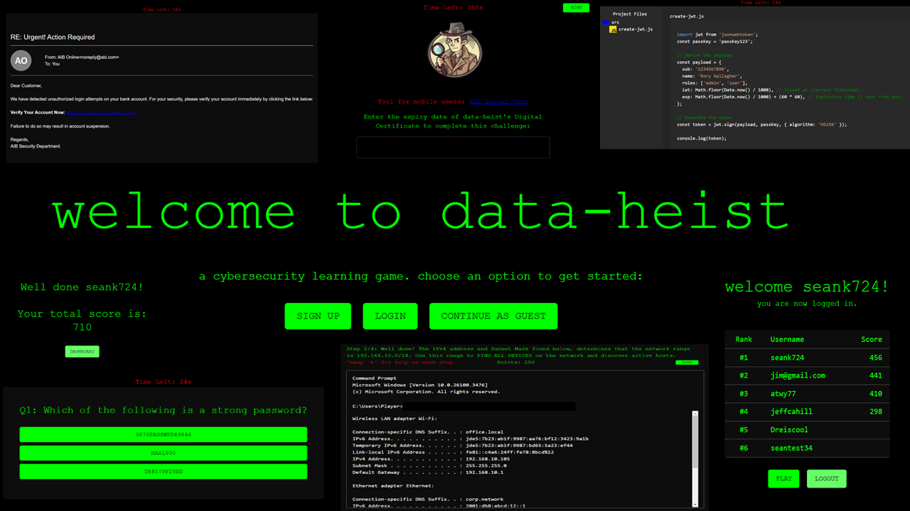

<p align="center">
<h1 style="font-size: 36px; margin-bottom: 20px;">data-heist</h1>

</p>

<!-- TABLE OF CONTENTS -->
<details>
  <summary>Table of Contents</summary>
  <ol>
    <li><a href="#about-the-project">About The Project</a></li>
    <li><a href="#links">Links</a></li>
    <li><a href="#installation">Installation</a></li>
    <li><a href="#acknowledgments">Acknowledgments</a></li>
  </ol>
</details>

<!-- ABOUT THE PROJECT -->
# About The Project

**Assignment Overview**  
This project has being developed as part of a Higher Diploma in Computer Science final project. It is a browser-based cybersecurity gamified revision to that challenges users to complete interactive tasks.

### Core Features (Backend):
- User authentication with JWT (Sign Up, Login)
- Persistent leaderboard storing high scores
- Protected routes for authenticated users
- Hashing & Salting of passwords
- Token Verification Middlware
- Error Handling

### Core Features (Frontend):
- Options to sign up or play as guest
- Timed challenges
- Hint buttons
- Points system based on time remaining, correct answers, & hints
- Dynamic feedback per challenge
- Leaderboard for top 10 players
- Responsive design using Material UI (MUI)
- Alerts and dialog overlays for instructions and results
- Step-by-step guidance for complex challenges
- Custom terminal-style Nmap simulation

### Software & Platforms Used
#### Frontend
- React (with Vite)
- TypeScript
- Material UI (MUI)
- Vercel (Deployment)

#### Backend
- Node.js
- Express
- MongoDB (via Mongoose)
- JWT for authentication
- CORS for secure cross-origin requests
- Render (Deployment)

#### Dev Tools
- Visual Studio Code
- Postman (API testing)

<p align="center"></p>

<!-- Deployment -->
## Links:
 
**Play the fully deployed application here:** https://data-heist-seank.vercel.app/<br>
**Project Landing page:** https://seankervick.github.io/data-heist-project-page/<br>
**Client (Frontend) commit history:** https://github.com/SeanKervick/data-heist-frontend<br>
**Backend commit history:** https://github.com/SeanKervick/data-heist-backend

---

## Local Installation

1. Clone the parent repository  

```bash
git clone https://github.com/SeanKervick/data-heist-full-stack.git
cd data-heist-full-stack
```
2. Install backend dependencies
```bash
cd backend
npm install
```
3. Set up backend environment variables<br>
Create a .env file inside the backend/ folder based on .envEXAMPLE and add your MongoDB URI, JWT secret, & Admin credentials

4. Start the backend server
```bash
npm run dev
```

5. Open a new terminal tab and install frontend dependencies
```bash
cd ../client
npm install
```

6. Set up frontend environment variables
Create a .env file in client/ with:
```bash
VITE_API_URL=http://localhost:5000
```

7. Start the frontend app

```bash
npm run dev
```

8. Open your browser and visit:
```bash
http://localhost:5173
```

